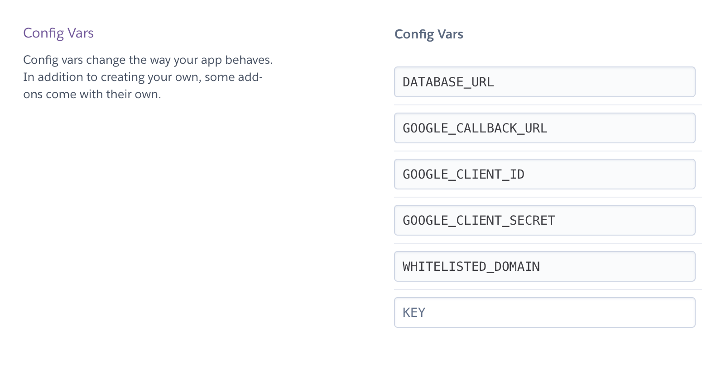

### Requirements

We are using docker-compose version 3.3 and it requires:

- Docker engine 17.06.0+
- Docker compose 1.14.0+

For more info, check out the compatibility matrix on Docker's website: [compatibility-matrix](https://docs.docker.com/compose/compose-file/compose-versioning/#compatibility-matrix)

## Work locally with this repo

Start by cloning this repository.

We have set up `docker-compose` to start postgres and the unleash server together. This makes it really fast to start up unleash locally without setting up a database or node. Change environment variables in docker-compose.yml

```bash
$ docker-compose build
$ docker-compose up
```

## Deploy to Heroku

Log in to Container Registry:

```bash
heroku container:login
```

Navigate to the server directory and create a Heroku app:

```bash
heroku create
```

Build the image and push to Container Registry:

```bash
heroku container:push web
```

Then release the image to your app:

```bash
heroku container:release web
```

Config variables enviroment



Now open the app in your browser:

```bash
heroku open
```
